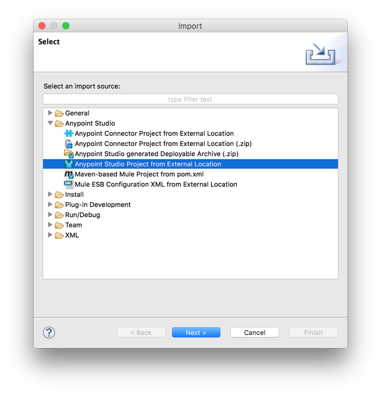
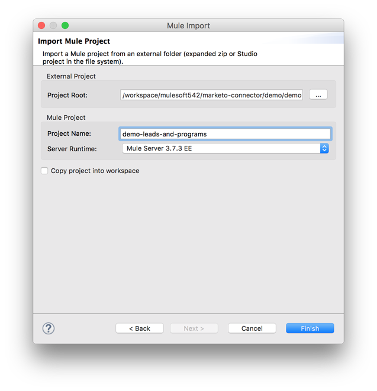
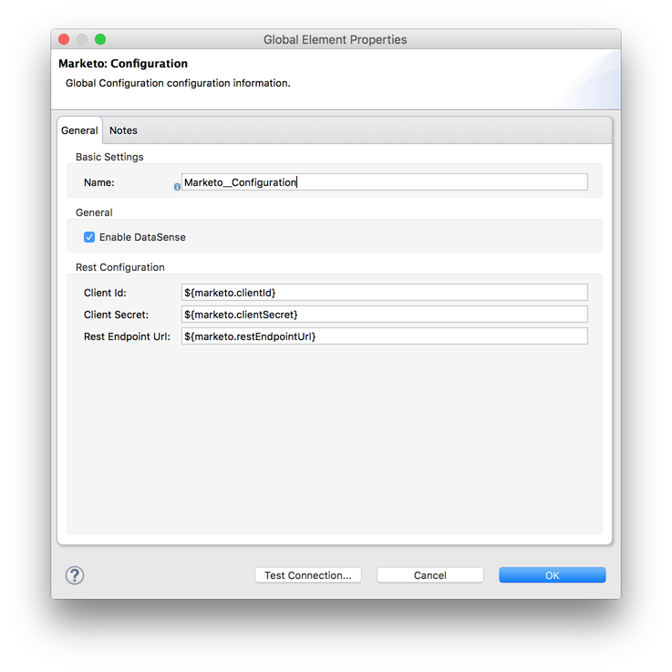
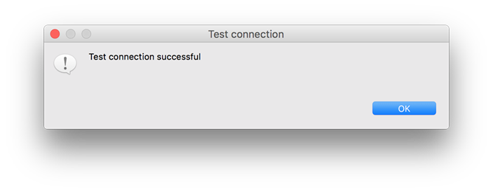
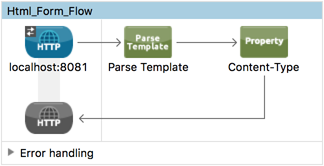
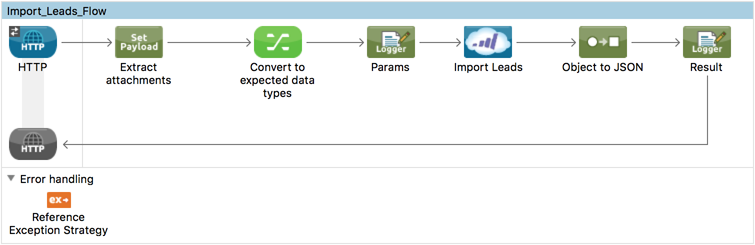
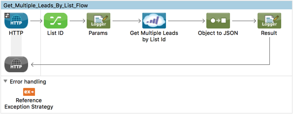
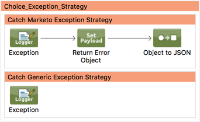
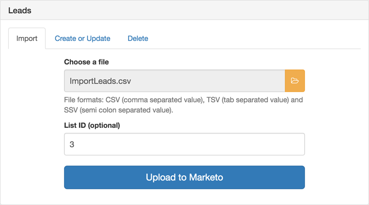
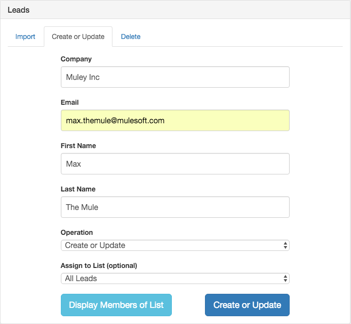

# README.md Template for Demos

# [Connector_Name] Anypoint&trade; Studio Connector Demo - [Demo_Name]

## Introduction

[Purpose of the demo. What functionality is being demonstrated? Which services is are being invoked?]

Example:
The current demo application acts as an RFC Server which registers itself at a SAP Gateway, waiting for any incoming BAPI requests triggered from an external SAP system.


## Prerequisites

Example:
* Java 7
* Anypoint Studio 5.4.x
* Mule Runtime 3.7.x EE
* [Optional] DataWeave (if connector is Certified, Premium or Select)
* [Optional] Access to a [Connector] instance 
* [Optional] Required dependencies]


## Import the project

* Go to **File > Import**
* Select **Anypoint Studio Project from External Location** (under the parent folder "Anypoint Studio")



* Provide the root path to the demo project folder.
* Select **Mule Runtime (3.7.x EE).**



* Click **Finish**.  
* Configure [Connector] credentials inside the file `src/main/app/mule-app.properties`.

```
connector.username=<USERNAME>
connector.password=<PASSWORD>
```

* Open the **Global Element Configuration**.



* [Optional] Load the required [Connector] dependencies, performing the following steps for each one:
	
    - Click the **Add File** button.
    - **Navigate** to the location of the file and select it.
    - Make sure a **green tick** appears next to the library, thus confirming the file ws correctly selected.

* Click the **Test Connection** button to ensure there is connectivity with the sandbox.

	> Test Connection is a **crucial** step. If you are experiencing connectivity issues, you won't be able to execute any part of this or any other demo, nor make use of DataSense.

* A successful message should pop-up.


* Open a browser and access the URL `http://localhost:8081`. You should see the demo application deployed:


## About the flows

[Short description and screenshots of **ALL** the flows contained in the demo application. If the demo is built around a single flow, provide a more in-depth explanation of the interaction between its components.]

**NOTE:** it is mandatory that demo applications implement **exception handling** strategies.

**1. Html_Form_Flow:** renders the HTML form with a `parseTemplate` component.



**2. Processor_Name_1_Flow:** description of the tasks or action executed by the flow. E.g. retrieves the information of an existing Ingredient given its ID.



**3. Processor_Name_2_Flow:** description of the tasks or action executed by the flow. E.g. retrieves the information of an existing Ingredient given its ID.



**4. Exception_Strategy_Flow:** description of the exception handling flow.




## Run the demo

[Provide a simple **step-by-step guide (with screenshots)** to successfully execute the demo. Explain the pre-conditions and post-conditions of the use case. If the application provides several use cases, describe them all. This may include any actions or configurations required by/from the sandbox to trigger the demo and/or to verify results.]

Example 1:

### Import Lead



* Click on the tab **"Import"**.
* Select the file that contains the information of the Leads to be imported. Accepted types include CSV, TSV or SSV. A sample CSV file has been attached to the demo inside the directory `${DEMO}/data/ImportLeads.csv`. It contains the information of 3 Leads:

```
lastName,firstName,title,company,email,phone,leadStatus,leadScore,leadSource,updatedAt
The Mule,Max,CEO,Muley Inc,max.themule@mulesoft.com,,,,,2016-04-07 11:22:33
Charleston,Charles,Vice President Junior,Muley Inc, charles.charleston@mulesoft.com,,,,,2016-04-07 11:22:33
Jenkins, Mister,Product Manager,Muley Inc,mister.jenkins2@mulesoft.com,,,,,2016-04-07 11:22:33
```

* Optionally, specify the ID of a Static list.
* Click the button **"Upload to Marketo"** and wait a few moments to finish processing.
* A pop-up message will indicate if the operation was successful or not. 

Example 2:

### Create or Update



* Click on the tab **"Create"**.
* Fill in the following required fields: 
	* Company
	* Email
	* Last Name
	* First Name
* Select an operation from the "Operation" menu: Create Only, Update Only, Create or Update, Create Duplicate.
* Select a list from the "Add to List" menu.
* Click the button **"Create or Update"** and wait a few moments to finish processing.
* A pop-up message will indicate if the operation was successful or not. 

**Congratulations!** You have successfully run this demo. You can continue exploring the endless possibilities of the connector by playing with other available [demos](http://mulesoft.github.io/connector-name/) or visiting the [[Connector_Name] Documentation Site](https://docs.mulesoft.com/mule-user-guide/v/3.8/connector-name).